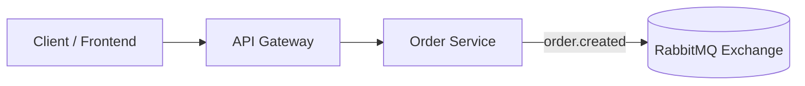

# Publish–Subscribe (Pub/Sub) Pattern: Order Created Event

This step implements the Pub/Sub pattern using RabbitMQ for the `order.created` event. When an order is created, the event is published to RabbitMQ, which then distributes it to multiple queues for different services to react independently.

**Flow:**

- The `order.created` event is sent from the Order Service to a RabbitMQ Exchange.
- RabbitMQ will distribute this event to multiple queues (e.g., payment, inventory, notification) in the next steps.

**Next Steps:**
- Implement queue bindings and consumers for each service.
